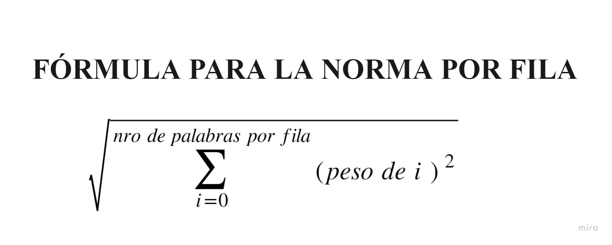
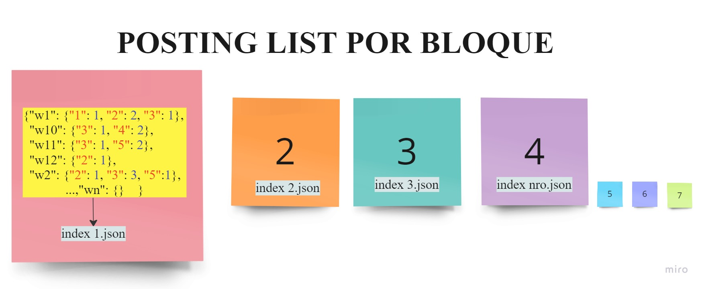
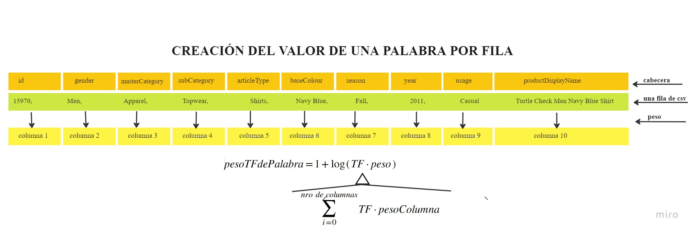
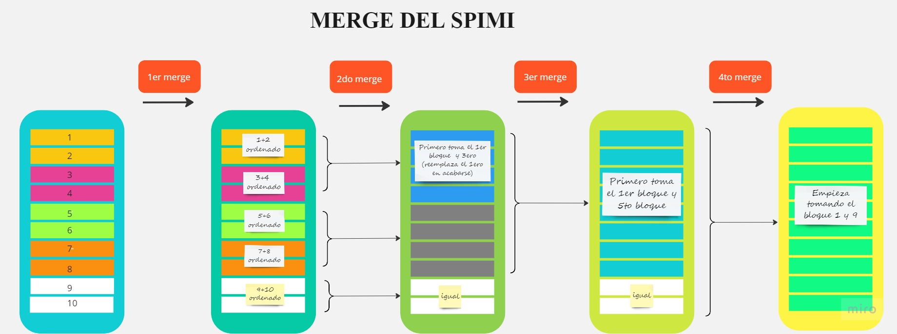

# Búsqueda y recuperación de la información
## Organización del equipo
| Participante | Papel |
|--------------|--------------|
| Mariana Capuñay   | Procesamiento del CSV-Creación de índice invertido, Manejo de índices, Implementación de SPIMI, Merge |
| Manyory Cueva    | Frontend, Ponderación de pesos en postgresql, cosine  | 
| Jaime Ramos    |  Creación del índice invertido, Análisis de normas por fila, Conexión con postgresql, Análisis de SPIMI, Merge | 
| Gustavo Orosco  |  | 

# Tabla de contenidos 
## Introducción
1. [Descripción del dominio de datos](#id1)
2. [Librerías utilizadas](#id2)
3. [Técnica de indexación de las librerías utilizadas](#id3)
4. [Como se realiza el KNN Search y el Range Search](#id4)
## Backend
5. [Construcción del índice invertido](#id5)
6. [Manejo de memoria secundaria](#id6)
7. [Ejecución óptima de consultas](#id7)
## Maldición de la dimensionalidad
8. [Análisis de la maldición de la dimensionalidad y cómo mitigarlo](#id8)

## Frontend
9. [Diseño del índice con PostgreSQL/MongoDB](#id9)
10. [Análisis comparativo con su propia implementación](#id10)
11. [Screenshots de la GUI](#id11)
## Experimentación
12. [Tablas y gráficos de los resultados](#id12)
13. [Análisis y discusión](#id13)
----------------------------------------------

## Descripción del dominio de datos
Fashion Products Dataset, es una recopilación estructurada de información sobre productos de moda. Esta información se separa en dos archivos principales **.csv**:

    

- **styles.csv**: Este archivo contiene las columnas *id, gender, masterCategory, subCategory, articleType, baseColour, season, year, usage, productDisplayName*. La información de cada producto es representada en una fila:

    

- **images.csv**: Este archivo contiene las columnas *filename,link*, donde 
  - *filename* representa el id de cada imagen 
  - *link* representa la ubicación de cada imagen

    

----------------------------------------------
## Librerías utilizadas
### Para el índice invertido
  - **nltk** : hacemos uso de la función *nltk.word_tokenize()* para el preprocesamiento. 
  

    

  

    

  También importamos el módulo *nltk.stem.snowball* para posteriormente usarlo con el método *SnowballStemmer('english')* y *stem*, lo cual nos permite reducir las palabras a su forma base o raíz (lexema)
    

    
  

    

    
  

  - **os** : hacemos uso de la función *os.path.getsize()*, la cual nos permite obtener el tamaño, en bytes, de un archivo especifico
  

    
  

  
  - **io** : hacemos uso de la función *io.DEFAULT_BUFFER_SIZE*, la cual representa el tamaño predeterminado del búfer utilizado por las operaciones de entrada/salida
  

    
  

  - **json** : para manejar la creación y lectura de los posting list en disco
  

    
  

  

    
  

  Adicionalmente, también hemos definido funciones que gestionan la lectura y escritura de un archivo **index+nro.json**
  

    
  

  

    
  

  

  - **math** : Usamos los métodos _pow_ y _sqrt_ para el cálculo de la norma por fila
    

    
  

  

    
  

### Para el índice multimedia
### Para el frontend

----------------------------------------------
## Construcción del índice invertido
  
  
  
  
  

# Idea
1. Leer el .csv de acuerdo a cantidad de un buffer (considerando que tome nro exacto de filas - no haga particion)
2. Concatenar datos de cada fila (preguntar acerca de ponderacion)
3. Formar un hash para cada bloque
4. Generar un posting_list -> [(docid, tf),...]  - como indice invertido
5. Una vez se completa pasos del 1 al 4, enviar el diccionario a disco
6. Ordena los terminos del diccionario
7. Escribe el indice invertido (del buffer - local) en disco
8. Repetir pasos del 1 al 7 por cada buffer
9. Retornar nombre de archivo en el que está cada buffer
10. Hacer Merge con todos los buckets  (mezcla en big Index)
    
# Json to Csv
Por temas de facilidad y actualización de funciones considerando la longitud variable  usaremos en el manejo de la data archivos json.

# Query Idea
1. Obtiene indice invertido de la query
2. Extrae indice invertido (general)
3. Aplica similitud coseno (no es necesario crear vectores de mismo espacio, hay que aprovechar uso de diccionarios para guardar cada termino)

# Para obtener posición de una fila
pos_row = tamaño de bytes leídos + 1
- pos_row de encabezado = 0
- pos_row de primera fila = pos_row(luego de encabezado) + tamaño de encabezado + len('\n') = 0+97+1
- pos_row de segunda fila = bytes antes de primera fila + tamaño de primera fila + len('\n') = 98 +93+1
