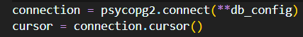
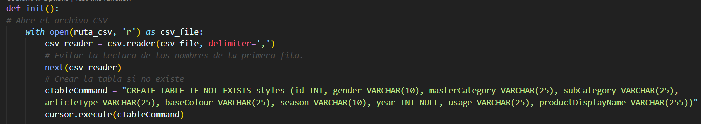
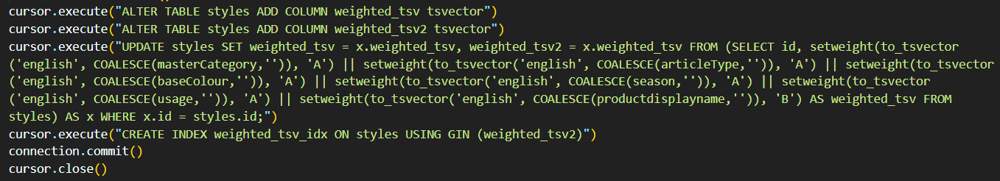
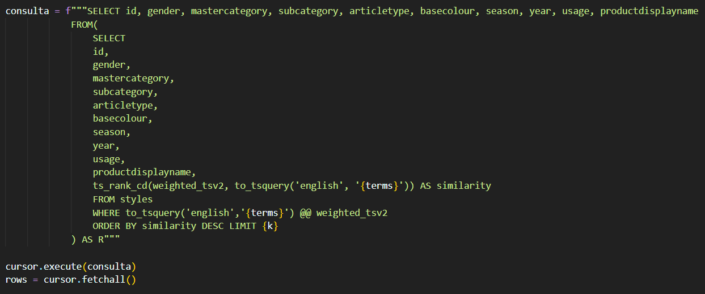
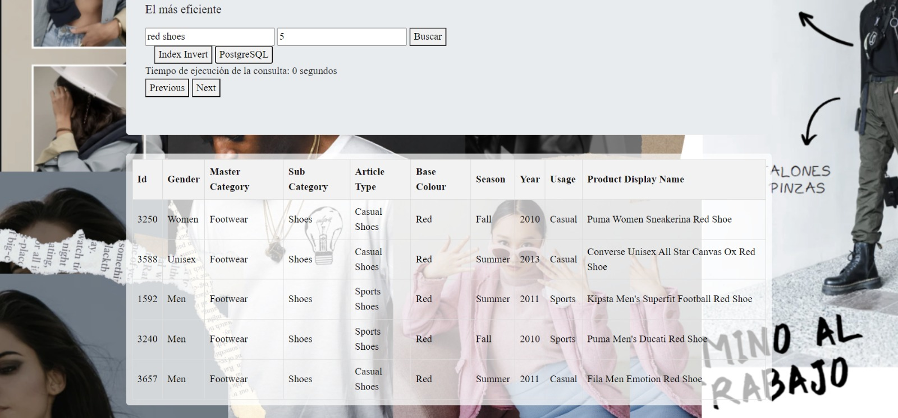

# Búsqueda y recuperación de la información
## Organización del equipo
| Participante | Papel |
|--------------|--------------|
| Mariana Capuñay   | Procesamiento del CSV-Creación de índice invertido, Manejo de índices, Implementación de SPIMI, Merge, cosine |
| Manyory Cueva    | Frontend, Ponderación de pesos en postgresql, cosine  | 
| Jaime Ramos    |  Creación del índice invertido, Análisis de normas por fila, Conexión con postgresql, Análisis de SPIMI, Merge | 
| Gustavo Orosco  | Binary search para buscar palabras, Generación de vectores caracteristicos e indices para registros de longitud variable, KNN secuencial | 

# Tabla de contenidos 
## Introducción
1. [Descripción del dominio de datos](#id1)
2. [Librerías utilizadas](#id2)
3. [Técnica de indexación de las librerías utilizadas - Indice multimedia](#id3)
4. [Como se realiza el KNN Search y el Range Search](#id4)
## Backend
5. [Construcción del índice invertido](#id5)
6. [Manejo de memoria secundaria](#id6)
7. [Ejecución óptima de consultas](#id7)
## Maldición de la dimensionalidad
8. [Análisis de la maldición de la dimensionalidad y cómo mitigarlo](#id8)

## Frontend
9. [Diseño del índice con PostgreSQL](#id9)
10. [Análisis comparativo con su propia implementación](#id10)
11. [Screenshots de la GUI](#id11)
## Experimentación
12. [Resultados de la query](#id12)
13. [Análisis y discusión](#id13)
----------------------------------------------

## 1. Descripción del dominio de datos
Fashion Products Dataset, es una recopilación estructurada de información sobre productos de moda. Esta información se separa en dos archivos principales **.csv**:

    

- **styles.csv**: Este archivo contiene las columnas *id, gender, masterCategory, subCategory, articleType, baseColour, season, year, usage, productDisplayName*. La información de cada producto es representada en una fila:

    

- **images.csv**: Este archivo contiene las columnas *filename,link*, donde 
  - *filename* representa el id de cada imagen 
  - *link* representa la ubicación de cada imagen

    

----------------------------------------------
## 2. Librerías utilizadas
### 2.1 Para el índice invertido
  - **nltk** : hacemos uso de la función *nltk.word_tokenize()* para el preprocesamiento. 
  

    
  

  

    
  

  También importamos el módulo *nltk.stem.snowball* para posteriormente usarlo con el método *SnowballStemmer('english')* y *stem*, lo cual nos permite reducir las palabras a su forma base o raíz (lexema)
    

    
    

    

    
    

  - **os** : hacemos uso de la función *os.path.getsize()*, la cual nos permite obtener el tamaño, en bytes, de un archivo especifico
  

    
  

  
  - **io** : hacemos uso de la función *io.DEFAULT_BUFFER_SIZE*, la cual representa el tamaño predeterminado del búfer utilizado por las operaciones de entrada/salida
  

    
  

  - **json** : para manejar la creación y lectura de los posting list en disco
  

    
  

  

    
  

  Adicionalmente, también hemos definido funciones que gestionan la lectura y escritura de un archivo **index+nro.json**
  

    
  

  

    
  

  - **math** : Usamos los métodos _log10_ y _sqrt_ para el cálculo de la norma por fila
  

    
  

  

    
  

  - **csv** : para obtener rápidamente cada fila del csv al construir la tabla en PostgreSQL. 
  

    
  

  - **psycopg2** : permite establecer la conexión con la base de datos en postgreSQL, así como ejecutar comandos desde Python y obtener sus outputs.
  

    
  

### 2.2 Para el índice multimedia
### 2.3 Para el frontend
  - **flask** : 

----------------------------------------------

## 3. Técnica de indexación de las librerías utilizadas - Indice multimedia 

----------------------------------------------

## 4. Como se realiza el KNN Search y el Range Search 

----------------------------------------------

## 5. Construcción del índice invertido
El dataset trabajado en este proyecto no puede manejarse en memoria RAM, por tal motivo hemos optado por una solución escalable que tome en cuenta las consideraciones de hardware: memoria, disco, velocidad.

Por temas de facilidad (considerando la longitud variable)manejaremos los diccionarios de la data archivos *.json*.

Nuestra implementación se basa en el algoritmo SPIMI (Single Pass In-Memory Indexing), el cual es utilizado para la construcción eficiente de índices invertidos.
  

    
  

  Nuestra implementación consiste en:
  1. Leer el archivo .csv de acuerdo a cantidad de un buffer (considerando que tome nro exacto de filas, es decir, no haga particion de filas)
  2. Preprocesar cada fila
  3. Concatenar datos de cada fila (calculando la norma y el peso de cada palabra por fila)
  

    
  

  - Para calcular el valor-peso de una palabra en una fila, consideramos su frecuencia en cada campo y multiplicamos  (frecuencia de palabra en el campo*peso del campo)
  

    
  

  4. Inicializar un hash (diccionario) para cada bloque: este diccionario contendrá
  - palabra: {pos_fila, peso de palabra para esa fila}
  - por palabra: solo se guardará las posiciones de filas en las que la palabra tiene un peso mayor a 0

  5. Completar el diccionario con todas las palabras preprocesadas del bloque
  

    
  

  6. Enviar el diccionario local (del buffer) a disco
  

    
  

  7. Repetir pasos del 1 al 6 por cada buffer
  8. Una vez que se termine de preprocesar todos los bloques del .csv, hacer Merge entre los índices locales (mezcla en big Index)
  

    
    
  

  9. Una vez terminado el paso 8, se tiene un solo índice global distribuido entre todos los archivos de índice (.json)

### Para obtener posición de una fila

$$ pos \space row \space actual = tamaño \space de \space bytes \space leídos $$

- pos_row de encabezado = 0
- pos_row de primera fila = pos_row(luego de encabezado) + tamaño de encabezado = 0+97 = 97
- pos_row de segunda fila = bytes antes de primera fila + tamaño de primera fila = 98 +92 = 190
----------------------------------------------

## 6. Manejo de memoria secundaria 

Utilizamos el archivo normas.json para almacenar el índice invertido generado. El diccionario almacena la información como [pos_row]:norma.

Luego, para comenzar a crear el índice global, almacenamos cada diccionario local en Local_Index. Al inicio, observamos que el número de diccionarios creados era excesivo (alrededor de 530). Además, encontramos que este número de archivos json perjudicaba la eficiencia de la creación del índice global.

Para ello, incrementamos el tamaño máximo de cada diccionario multiplicando el valor de DEFAULT_BUFFER_SIZE de la librería io por una cantidad que no perjudique la lectura de datos. Con ello, el número de diccionarios se redujo a 128.

    
  
  

Tras este cambio, procedimos a ejecutar el índice global con el algoritmo SPIMI. Para evitar mezclar o perder información en cada iteración, creamos una carpeta por cada iteración hasta el final del algoritmo. Finalmente, para liberar memoria, eliminamos los diccionarios de las carpetas procesadas por el merge excepto por la última, que contiene el índice global completo.

----------------------------------------------

## 7. Ejecución óptima de consultas 
Al recibir una query, lo que se hace es:
1. Obtener el índice invertido de la query
2. Aplicar similitud coseno (no es necesario crear vectores de mismo espacio, se aprovecha uso de diccionarios)

Adicional a ello, cabe recalcar que ya tenemos el índice invertido global de nuestro dataset en disco. Y que estamos haciendo uso de la búsqueda binaria para encontrar un término y sus ocurrencias:
  

    
  
  

Todo esto facilita el tiempo de las consultas (considerando que el índice invertido global del dataset solo se genera al inicio de nuestro programa y luego no se modifica).

## 8. Análisis de la maldición de la dimensionalidad y cómo mitigarlo 

## 9. Diseño del índice con PostgreSQL 

- Para cargar nuestro dataset en postgress hicimos uso de las librerías *psycopg2* y *csv*.
  

    
  
  

- Lo primero que hicimos, fue definir la función **init** para crear la tabla *styles* y poblarla con los datos del dataset.
  

    
  
  

- Además, dentro de la misma función, añadimos la creación de dos columnas del tipo *weighted_tsv*. Una de estas la indexaremos y será la que usaremos en nuestra búsqueda.
  

    
  
 

- Luego, definimos la función para retornar las k filas más similares a una query.
  

    
  
 

  *Al momento de realizar las pruebas notamos que si concatenamos cada palabra de la query con el operador AND ('&') se tiene respuestas más similares que si concatenamos los elementos con OR ('|'). Atribuimos que esto se da porque,  [según la documentación de SQL](https://www.postgresql.org/docs/current/textsearch-controls.html), la versión de búsqueda no considera la rareza de un término.* 

## 10. Análisis comparativo con su propia implementación 

## 11. Screenshots de la GUI 
  - Pantalla principal

  

    
  

## 12. Resultados de la query 
- Aplicamos la query textual *"red shoes"*
  - Resultados con índice invertido
    

      
    

  - Resultados con postgresSQL
    

      
    

- Aplicamos la query textual *"green pants"*
  - Resultados con índice invertido
    

      
    

  - Resultados con postgresSQL
    

      
    

## 13. Análisis y discusión 

- Al aplicar las queries textuales y comparar su similitud con los resultados obtenidos en postgresSQL, notamos que nuestra implementación es mucho más óptima al retornar los resultados similares. Sin embargo, postgres proporciona búsquedas más exactas al enviar cada palabra de la query con el operador AND ("&"), pero al usar el operador OR("|") no considera la rareza de los términos, ya que da resultados sin considerar que hay palabras que aparecen con mucha frecuencia.

